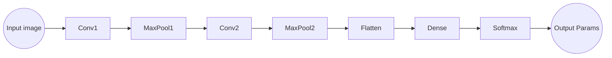

#  Facial Keypoints Detection 
## Abstract
     Our project tasks us with predicting keypoint positions on face images. The set of image features will vary from person to person, since there are many factors to keep in mind, including pose, size, position, viewing angle, and illumination conditions.
To do this we will be building, training and testing a Convolutional Neural Network to predict these facial keypoints.This allows us to extract image features that will aid in predicting key points on facial data. To help construct the CNN, we will use the Haiku API from DeepMind built on the backbone of the JAX python library.
The key result of this will be while using the Haiku API, it performed relatively well on the models but it did suffer from overfitting.  When our training data ran too well, it had a negative impact on our overall result. This is due to the fact that noise or random fluctuations in the training data were detected and abstracted to the model although it does not apply to the new data. 

# Introduction
     Facial detection is a very urgent system in our modern world. Applications such as facial recognition software used by law enforcement helps keep our streets safe but the question of how cameras can identify a face in each frame arises. ATMs are beginning to be built with cameras that allow for an added layer of security in case someone tries to withdraw money from a debit card without the owner knowing. We even unlock our smartphones with our faces! From adding an extra layer of protection/security to playful photograph filters, in this computer vision problem we must train our machines to learn how to identify a face. In our project we have attempted to create a facial key point detector which is the foundation of all these systems mentioned previously. This is a challenging problem because much like other biometrics such as fingerprints, faces tend to be universally unique, differing from person to person. Therefore, we must find a way to extract common features of every face and their positions such as the locations of eyes, mouth, and nose. To add to an already difficult problem, we must consider different viewing angles of faces along with different illumination/brightness, varying facial sizes and features. Because of this number of variables and variation in each, this regression task can not be considered trivial and still is an important field in the world of computer vision. Systems like the one we have created have all been implemented in areas such as facial recognition, tracking, analysis for medical diagnosis, and even biometric security (ie. Apple’s Face-ID). To build this system we must first understand what it needs to accomplish which is when given an image of a face, locate the key points where the left eye, right eye, nose tip, mouth corners and lips are. After accomplishing this, we must test this against a dataset of faces to prove that our system can account for the uniqueness and variability of faces.

# Related Work
      We utilized the following resources while researching for this project. 
- [Recurrent Phase Reconstruction Using Estimated Phase Derivatives from Deep Neural Networks](https://ieeexplore.ieee.org/abstract/document/9413722?casa_token=OaTG0zWTRgQAAAAA:B8LlRHy3SDq1cGgUH2s7ttuzxn9O-77qzCCu6h7uXTyKSnd1DycMjiVEFCTGsD4RFQJqgNvnOQ)
- [Equinox: neural networks in JAX via callable PyTrees and filtered transformations](https://arxiv.org/abs/2111.00254)
- [Haiku: Guide to Create Multi-Layer Perceptrons using JAX](https://coderzcolumn.com/tutorials/artificial-intelligence/haiku-guide-to-create-multi-layer-perceptrons-using-jax)

# Data
      Predicting facial key points is a regression problem that tasks us with predicting accurately the position of the 15 specified key points given any image. 

     The data we are given is a list of 96 x 96 grayscale images of human faces. The training set contains 7049 images and the validation set contains 1783 test images. This data set is particularly small, which will present an issue later on when trying to train the model. The values that we are tasked with predicting are continuous values that represent the locations ( Cartesian coordinates ) of each feature on each image. 

     Taking a deep dive into the image datasets, we can see immediately that the data set is not very high quality. Many of the training and testing images are of the same person. Additionally, there are some images that carry over from the training set to the test set, which may decrease the model's ability to accurately predict. 

     The data set is split into images that contain all 15 key points, and those that only contain 4 of the 15 key points. The landmarks for the each key point is also different between the 4 and 15 key point data set. 

## Data Augmentation
      In order to give our model the best chance at succeeding, i needed to make sure to clean and preprocess the data as much as possible. As stated in the previous section, the data set that is provided for this challenge is of small size and low quality. In this case, we can perform augmentation to increase the size of your dataset. Augmentation is often used in image-based deep learning tasks to increase the amount and variance of training data. In order to give our model the best chance of success, we will be flipping, rotation, cropping, translation, illumination, scaling and adding noise to the entire training set to introduce the largest amount of invariance possible. By creating several versions of our images in various orientations, we give our deep learning model more information to learn from without having to go through the time consuming process of collecting and labeling more training data.

### Converting Raw Data into images
     We start by iterating over each row in our data frame and converting all of the pixel data into images so that we can view the outcomes of our transformations and augmentations. The same is done for the key points data, which is then overlayed on top to of the image data to visualize the locations of each key point. 
> Example of Sample Image Data and Key Points

### Flipping Images on an Axis
      Flipping an image is a simple technique that allows us to improve our model's performance. The model is identifying collections of pixels and trying to learn the relationships between these pixels. However, Convolutional Neural Networks tend to be brittle and will memorize collections of pixels. Therefore, it may recognize an image one way around, but fail to recognize the same image when flipped on some axis. 
> Example of Sample Data Flipped on an Axis

### Rotating Images
      Image rotation is a particularly powerful augmentation. By changing the angles that the images appear, our model becomes more robust and resistant to overfitting situations. By increasing variation, our model is required to to learn features and characteristics of the data. 
> Example of Sample Image Rotated

### Brightness Augmentation 
      As mentioned earlier, the dataset that we are given is of particularly low quality. This is further evidenced when we observe that the images contained in the training and validation datasets are of varying brightness levels. In order to provide our model with the best ability to predict on such variations in image quality, we applied brightness increases and decreases randomly to every image in the testing dataset. 
> Example of Increase and Decrease in Image Brightness

### Shift Augmentation and Adding Noise
      Following the same methedology in the above examples, we also applied shifts and introduced noise to our images
>Example of Image Shift Augmentation

> Example of Image Noise Addition 

# Methods
      Now that we have solved the issue of augmenting the data, we can move on to building, training, and testing our model. 
      As we are dealing with images, we settled on using a Convolutional Neural Network to train on these images. Using a CNN will allow us to extract image features and predict the keypoints on other facial image data. 

### Model Design
      We deployed the [Haiku](https://github.com/deepmind/dm-haiku) API from the team at DeepMind to aid us in constructing our CNN. The model consists of two Convolutional layers either side of a Max-Pooling layer. The output of the second Convolutional layer is then fed into another Max-Pooling layer before being flattened. The flattened dimensions are then passed to a Dense ( Fully-Connected ) layer and run through a softmax layer before at the end of the network. All of the layers in the network were coded using the Haiku API. The Haiku API allows us to create a class ( that extends the haiku.Module class ). Via this inheritance, our class can override the __call\_\_ function to allow us to transform this class into a function that can be called using JAX function transformations. 
> From Deepmind's [Github](https://github.com/deepmind/dm-haiku):
> "`hk.Module`s are Python objects that hold references to their own parameters, other modules, and methods that apply functions on user inputs.
>`hk.transform` turns functions that use these object-oriented, functionally "impure" modules into pure functions that can be used with `jax.jit`, `jax.grad`, `jax.pmap`, etc.

#### Diagram of Model Design

### Model Training
      The model was deployed using Google's colab notebook. In order to prevent the notebook from using too much memory, the team decided to train the model in batches.  We can cover the entire dataset by training the model on small batches of data and updating the weights and parameters of the network after each batch. 

      We initialized model weights using a seed of random numbers generated by jax.random(). We also set the batch size to 32, the number of epochs to 10 and the learning rate to 0.01. We are using the Mean Square Error to evaluate loss through our network and print that to the screen every 20 epochs.

### Making Predictions
      After training the network, we can make predicitions on our test and validation data sets by using the jax.apply() method, passing the parameters that were optimized for in the previous trainings and each dataset into the function. 

# Experiments
      After constructing and training our model, the team decided to compare our model's performance to that of one coded in one of the major Python Machine Learning frameworks, TensorFlow / Keras or Pytorch. We compared our model to that used by the highest rated submission on kaggle for this challenge, at the time of writing. [Link to kaggle submission](https://www.kaggle.com/code/chr9843/myfacialkeypointsnb)

#### Results
      After training the model and running it against the validation set of the data, we compiled some graphs in order to illustrate the effectiveness and accuracy of our model.
> MSE per Epoch

> Accuracy per Epoch

> Loss per Epoch

      As you can see from these results, the model performs well on the training data and over 100 epochs, produces a loss that is acceptable. However, when it comes time to validate the models performance with the test dataset, the model performs significantly worse than it did on the train set. This is a classic case of the model overfitting the data. This is in stark comparison to the results obtained from the kaggle notebook listed above.
> Results obtained from the Kaggle Notebook linked above 

      We believe that the model is overfitting for a number of reasons. Most chiefly of those reasons, is that the model may have picked up on too much of the augmentations that we performed on the dataset and memorized patterns as opposed to learning features. This can be recitified by decreasing the complexity of the model and increasing the number of epochs. We can also reduce loss even further by normalizing the data. As the images length and breadth cannot exceed 96 pixels, so the landmark coordinates cannot exceed 96 either. If you divide the total target (y) array by 96 then those values will range between 0 to 1. As a result the model will be less likely to overfit. 

# Conclusion
      In conclusion, the model built with Haiku / JAX performs well. With more time and more effort, this model could easily rival the level of performance and scailability of some of the more popular. In order to prevent an overfitting scenario, one would need to normalize the data such that the dimensions / shape remain consistant with that of the input images. This would prevent the model from memorizing features, therefore enabling the model to properly fit the data. 

### Footnote
Authors
- Villaire A. P.
- Dilip C.
- Willis D.
